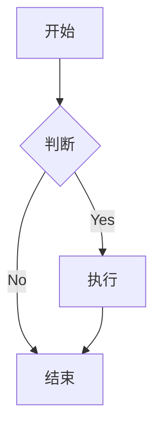

# Mermaid Preview

一个强大的 Chrome 扩展，用于实时预览和编辑 Mermaid 图表，支持智能解析和多种导出格式。

## 功能特点

- 🎨 实时预览 Mermaid 图表
- 🔄 自动适配预览大小
- 🎯 支持拖拽和缩放
- 💾 多格式导出（PNG、JPG、PDF）
- 🌓 深色/浅色主题切换
- 🤖 AI 智能解析（即将推出）

## 项目依赖

### 前端依赖
```json
{
  "dependencies": {
    "react": "^18.2.0",
    "react-dom": "^18.2.0",
    "mermaid": "^10.0.0",
    "@radix-ui/react-icons": "^1.0.0",
    "react-resizable-panels": "^0.0.55",
    "html2canvas": "^1.4.1",
    "jspdf": "^2.5.1",
    "clsx": "^2.0.0",
    "tailwind-merge": "^2.0.0",
    "lucide-react": "^0.294.0"
  },
  "devDependencies": {
    "@types/react": "^18.2.0",
    "@types/react-dom": "^18.2.0",
    "typescript": "^5.0.0",
    "tailwindcss": "^3.3.0",
    "autoprefixer": "^10.4.0",
    "postcss": "^8.4.0",
    "vite": "^4.0.0",
    "@vitejs/plugin-react": "^4.0.0"
  }
}
```

### 后端依赖（AI 解析服务）
```json
{
  "dependencies": {
    "@vercel/node": "^2.0.0",
    "openai": "^4.0.0",
    "cors": "^2.8.5",
    "dotenv": "^16.0.0"
  }
}
```

## 安装说明

### 本地开发

1. 克隆项目
```bash
git clone https://github.com/yourusername/mermaid_preview.git
cd mermaid_preview
```

2. 安装依赖
```bash
npm install
```

3. 启动开发服务器
```bash
npm run dev
```

4. 构建扩展
```bash
npm run build
```

### 在 Chrome 中安装

1. 打开 Chrome 浏览器
2. 访问 `chrome://extensions/`
3. 开启"开发者模式"
4. 点击"加载已解压的扩展程序"
5. 选择项目的 `dist` 目录

## 使用说明

### 基本使用

1. 点击 Chrome 工具栏中的扩展图标
2. 在左侧编辑器中输入 Mermaid 代码
3. 右侧会实时显示预览效果

### 图表操作

- **缩放**：使用鼠标滚轮或点击工具栏的放大/缩小按钮
- **拖动**：按住鼠标左键拖动图表
- **重置视图**：双击预览区域或点击重置按钮
- **切换主题**：点击右上角的主题切换按钮

### 导出功能

支持以下格式导出：
- PNG（透明背景）
- JPG（白色背景）
- PDF（保持原始尺寸）

### 示例代码



## 注意事项

1. 确保浏览器已更新至最新版本
2. 导出大型图表时可能需要等待几秒钟
3. 某些复杂的 Mermaid 语法可能需要刷新页面才能正确渲染

## 常见问题

Q: 为什么图表没有实时更新？  
A: 检查 Mermaid 代码语法是否正确，或尝试刷新页面。

Q: 如何调整预览区域大小？  
A: 可以拖动中间的分隔条来调整左右两侧的宽度比例。

## 贡献指南

欢迎提交 Pull Request 或创建 Issue。在提交代码前，请确保：

1. 代码已经过格式化
2. 所有测试都已通过
3. 提交信息清晰明了

## 许可证

MIT License 