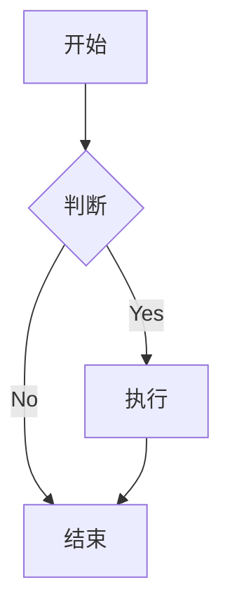

# Mermaid Preview

一个强大的 Chrome 扩展，用于实时预览和编辑 Mermaid 图表，支持智能解析、AI自动纠错和多种导出格式。

## 功能特点

- 🎨 实时预览 Mermaid 图表、Markdown代码
- 🔄 自动适配预览大小
- 🎯 支持拖拽和缩放
- 🤖 AI自动纠错功能
  - 智能检测语法错误
  - 一键AI修复代码
  - 支持多种AI服务商
- 💾 多格式导出
  - Mermaid：（PNG、JPG、PDF）
  - Markdonw：HTML
- 🌓 深色/浅色主题切换
- ⚙️ 灵活的AI配置选项

## AI功能

### 支持的AI服务商

- **DeepSeek** - 默认推荐，性能优异
- **Kimi (月之暗面)** - 中文支持良好
- **OpenAI** - 经典选择（需要实现）
- **Claude** - Anthropic的AI助手（需要实现）
- **智谱AI** - 国产AI服务（需要实现）

### AI配置步骤

1. 点击"设置"Tab页
2. 选择AI服务商
3. 输入API Key
4. 配置Base URL（可选）
5. 设置模型名称（可选）
6. 调整Temperature和Token数量
7. 自定义修复提示词（可选）
8. 点击"保存配置"

### 获取API Key

**DeepSeek API Key获取：**
1. 访问 [DeepSeek开放平台](https://platform.deepseek.com)
2. 注册账号并登录
3. 在API Keys页面创建新的API Key
4. 复制API Key到配置中

**Kimi API Key获取：**
1. 访问 [Kimi开放平台](https://platform.moonshot.cn)
2. 注册账号并登录
3. 在API Keys页面创建新的API Key
4. 复制API Key到配置中

## 项目依赖

### 前端依赖
```json
{
  "dependencies": {
    "react": "^18.2.0",
    "react-dom": "^18.2.0",
    "mermaid": "^10.0.0",
    "@radix-ui/react-icons": "^1.0.0",
    "react-resizable-panels": "^0.0.55",
    "html2canvas": "^1.4.1",
    "jspdf": "^2.5.1",
    "clsx": "^2.0.0",
    "tailwind-merge": "^2.0.0",
    "lucide-react": "^0.294.0"
  },
  "devDependencies": {
    "@types/react": "^18.2.0",
    "@types/react-dom": "^18.2.0",
    "typescript": "^5.0.0",
    "tailwindcss": "^3.3.0",
    "autoprefixer": "^10.4.0",
    "postcss": "^8.4.0",
    "vite": "^4.0.0",
    "@vitejs/plugin-react": "^4.0.0"
  }
}
```

## 安装说明

### 在 Chrome 中安装

1. 打开 Chrome 浏览器
2. 访问 `chrome://extensions/`
3. 开启"开发者模式"
4. 点击"加载已解压的扩展程序"
5. 选择项目的 `dist` 目录

## 使用说明

### 基本使用

1. 点击 Chrome 工具栏中的扩展图标
2. 在左侧编辑器中输入 Mermaid 代码
3. 右侧会实时显示预览效果

### AI自动纠错使用

1. **配置AI服务**：
   - 点击"设置"Tab页
   - 选择AI服务商（推荐DeepSeek）
   - 输入API Key并保存配置

2. **使用AI修复**：
   - 在编辑器中输入有错误的Mermaid代码
   - 预览区会显示具体的错误信息
   - 点击编辑器底部的"使用AI修复"按钮
   - AI会自动分析并修复代码错误

3. **错误检测**：
   - 系统会自动检测语法错误类型
   - 显示具体的错误原因和修复建议
   - 支持多种Mermaid图表类型的错误检测

### 图表操作

- **缩放**：使用鼠标滚轮或点击工具栏的放大/缩小按钮
- **拖动**：按住鼠标左键拖动图表
- **重置视图**：双击预览区域或点击重置按钮
- **切换主题**：点击右上角的主题切换按钮

### 导出功能

支持以下格式导出：
- PNG（透明背景）
- JPG（白色背景）
- PDF（保持原始尺寸）

*注意：导出功能已优化，支持复杂图表的完整导出*

### 示例代码



## 注意事项

1. 确保浏览器已更新至最新版本
2. 导出大型图表时可能需要等待几秒钟
3. 使用AI功能需要网络连接
4. API Key请妥善保管，避免泄露

## 常见问题

**Q: 为什么图表没有实时更新？**  
A: 检查 Mermaid 代码语法是否正确，或尝试刷新页面。

**Q: 如何调整预览区域大小？**  
A: 可以拖动中间的分隔条来调整左右两侧的宽度比例。

**Q: AI修复功能显示"请配置API Key"怎么办？**  
A: 请先在设置页面配置AI服务商的API Key。

**Q: 为什么AI修复失败？**  
A: 可能的原因：
- API Key无效或过期
- 网络连接问题
- API服务暂时不可用
- 代码错误过于复杂

**Q: 导出的图片不完整怎么办？**  
A: 这个问题已经修复，现在支持完整导出复杂图表。

**Q: 支持哪些AI服务商？**  
A: 目前支持DeepSeek和Kimi，其他服务商正在开发中。

## 开发说明

### 构建项目

```bash
# 安装依赖
npm install

# 开发模式
npm run dev

# 构建扩展
npm run build

# 构建Web版本
npm run build:web
```

### 项目结构

```
src/
├── core/                 # 核心功能模块
│   ├── components/      # React组件
│   │   ├── editor-tabs/ # 编辑器标签页
│   │   ├── preview/     # 预览组件
│   │   ├── settings/    # 设置页面
│   │   └── shared/      # 共享组件
│   ├── lib/             # 工具库
│   │   ├── ai/          # AI服务集成
│   │   ├── mermaid/     # Mermaid渲染
│   │   └── utils/       # 工具函数
│   └── types/           # TypeScript类型定义
├── extension/           # 浏览器扩展
└── assets/             # 静态资源
```

## 贡献指南

欢迎提交 Pull Request 或创建 Issue。在提交代码前，请确保：

1. 代码已经过格式化
2. 所有测试都已通过
3. 提交信息清晰明了
4. 遵循SOLID设计原则

## 许可证

MIT License 